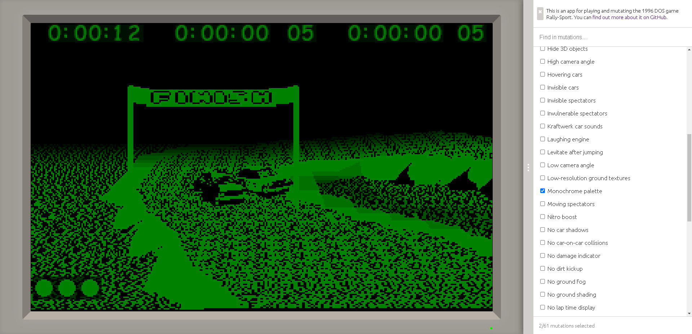

# rs

An app for playing and corrupting the 1996 DOS game [Rally-Sport](https://web.archive.org/web/19970805142345/http://www.cs.tut.fi/~k140734/Rally-Sport/index.html), in the browser.

Paraphrasing the idea of game corruptions from [corrupt.wiki](https://corrupt.wiki/):

> The act of "corrupting games" is taking a video game and breaking it using whatever means necessary, usually with a program called a corruptor. This software can modify the game's files to produce unexpected or unusual graphics, gameplay or audio.

\
*Monochrome racing.*

\
*Solid-colored landscapes with flat cars.*

## Usage

You can access the app live on the web at [tarpeeksihyvaesoft.com/rs](https://tarpeeksihyvaesoft.com/rs).

The UI is hopefully intuitive enough to navigate. If you find anything unclear or unintuitive, please post an issue report here on GitHub.

Rally-Sport's keyboard controls are as follows (I don't know whether these key bindings are specific to the Finnish keyboard layout):

| Key      | Action                 |
| -------- | ---------------------- |
| A        | Accelerate             |
| Z        | Brake                  |
| (Comma)  | Turn left              |
| (Period) | Turn right             |
| Space    | Activate a menu option |
| Esc      | Quit the game          |

### System requirements

If you're using a modern browser with JavaScript enabled, you should be good to go. Performance might be best on Chrome.

You'll need a keyboard to play the game, and in general the app expects you to be in a desktop-like computing environment.

## Contributing corruptions

If you have corruptions you'd like to contribute, you're welcome to open pull requests.

First, read through the Background section below, then keep reading to find out what's expected of a pull request.

### Background

The app calls corruptions *mutations*. You can find its existing mutations in [./src/mutations.js](./src/mutations.js).

The following is a sample mutation as it would be defined in [./src/mutations.js](./src/mutations.js):

```js
"The mutation's name": {
    payload: [
        // Commands to modify the game's data go here.
        "byte rallye.exe 1 255",
    ],
    tooltip: "An optional tooltip shown when the user hovers the cursor over this mutation in the UI.",
    author: "Your name or alias.",
    id: "The last part of a randomly-generated UUID (v4) goes here.",
}
```

The `payload` attribute defines an array of strings that will be passed as commands to the browser-based DOSBox running the game. These commands have access to the `byte` executable, which takes as its arguments a target file's name, a byte offset, and a byte value to be written to that offset in the file (all numeric values are to be given as decimals).

A mutation typically issues as its payload one or more calls to the `byte` command to modify particular bytes in the game's files (usually, its main executable, RALLYE.EXE) and so to effect the desired corruption. For example, a mutation might change the value of a hard-coded variable, or modify opcodes to influence program flow.

### Making the contribution

Follow these general steps:

1. Fork this repo.
2. Add your mutation to the forked [./src/mutations.js](./src/mutations.js) file.
3. Open a pull request for the change. In the pull request, describe briefly what's being corrupted and how.

Things to keep in mind:

- Try to keep it to one mutation per pull request.
- Each mutation must have a unique `id` attribute; generally the last 12 symbols of a version 4 UUID.
- Each mutation must have an `author` name.
- If you're planning on mutating something other than RALLYE.EXE, first open a pull request for supporting that kind of mutation. Even though the `byte` command already allows targeting files other than RALLYE.EXE, there are other considerations - like file persistence - that I'd like to address first.
